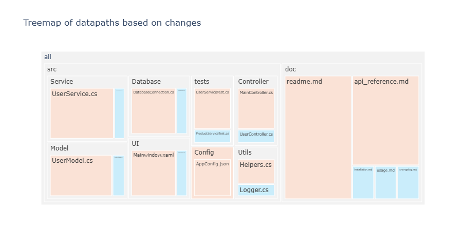
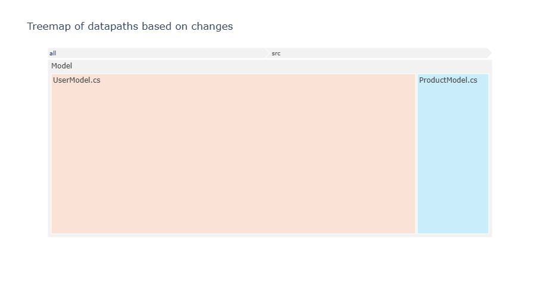

# Project Overview

### Main Features
`createHotspots.py` is a small tool that automatically generates an interactive treemap in the web browser functioning as a tool for Hot- and Coldspotanalysis using the [plotly](https://plotly.com/python/treemaps/) framework. It generates data using the [git log](https://git-scm.com/book/en/v2/Git-Basics-Viewing-the-Commit-History) history from a local git repository given by the user.  

A file is regarded as a cold- or hotspot, depending on the date the change on the file has been commited. To differentiate between cold- and hotspots, the tool uses a **reference date** (i.e. 2024-02-22) given by the user.   
**Hotspots** are files that have recently been changed, meaning changes on the file that have been commited after the refernce date.   
**Coldspots** are files that have not been changed recently, meaning there are no changes commited after the reference date. 

Example on how a treemap might look like using pseudo data: 

### Target Audience 
(also refer to scenarios and personas)

# Installation Guide
### Requirements
### Installation Steps

# User Manual
### Step by Step Guide
with screenshots and code snippets